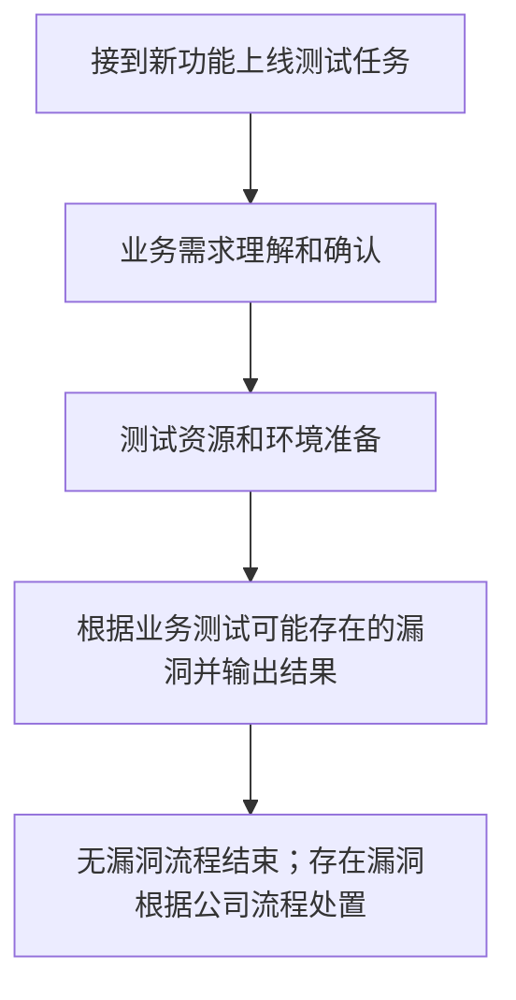
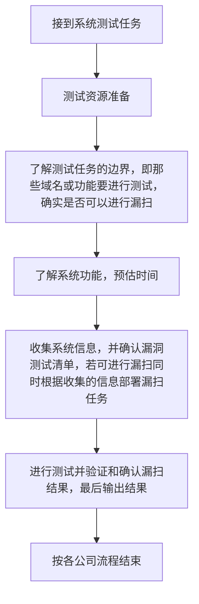
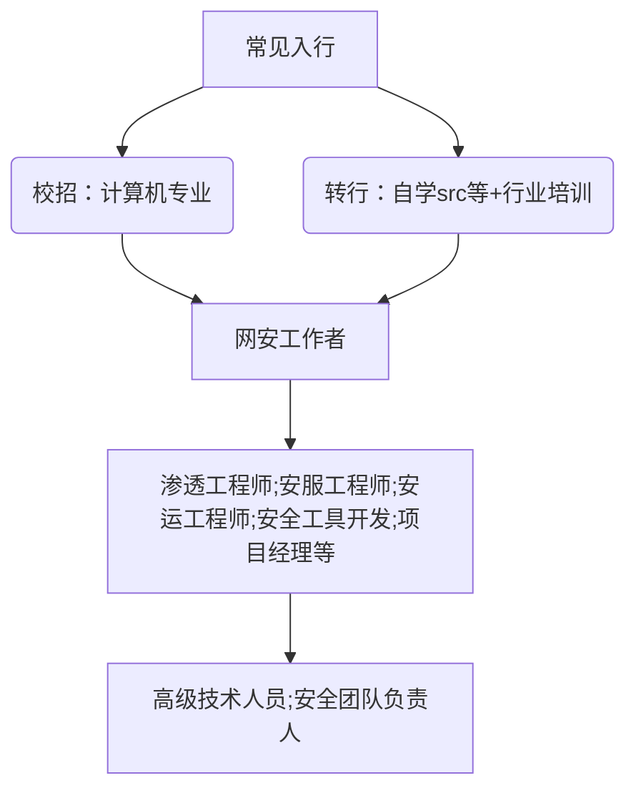

## 一、职业速写
> **核心价值**：保护公司系统安全能力在水准线上，不会被常见漏洞及已知严重漏洞给轻易攻进系统或盗取大量敏感信息。

## 二、真实工作全景
### ▋ 典型工作场景

#### 新业务上线

#### 系统性测试（针对系统所有或部分功能）

### 工作日常

	我的工作日常大概是先恍恍惚惚一上午，因为到公司就九点半了，两个半小时后就吃饭了，所有一般非会议或急事上午都晃过去了。下午一点半上班后磨磨唧唧一会两点了，然后有活就干会，基本六点前就能做完，然后等七点左右下班了。少数有五点来急活的，第一步就是先问然后多说两句这种不行，反正我现在基本很少有了。

	因为我不属于标准安服工程师了，在技术层面上属于一个人的安全部了，属于还有部分外部的安全会议要参加，内部的部分需求会议和技术方案确认相关的会议要参加，而正常来说这些安服工程师都不用负责，甲方的安服工程师一般来说都是比较轻松的工作了。

### ▋ 主要职责

- 对公司系统进行安全性测试和评估
- 对公司内出现的安全事件进行应急响应
- 对接安全合规需求并提供相关建议和部分文档和数据支持0.
## 三、能力需求
### 硬技能清单

- 主流系统常见应急场景和处置方案（google，公众号，知识星球等获取）
- 掌握常见web漏洞挖掘和修复方案（Google，《白帽子讲web安全》，b站等获取）
- 熟悉主流安全设备的使用，包括但不限于ids、waf、防火墙、流量监控设备等（可以查看安全厂商白皮书，不行遇上了现学应该也来得急，万变不离其宗，网络知识和安全原理可以理解其肌理，剩下的就是语法和规则配置以及设备能力的认识问题了）
- 加解密算法的基本知识；网络基础知识（各类基础知识真蛮重要的，书籍和视频都可以看看，不一定要完全记得细节，但安全性以及可能导致的各种问题还是知道的，同时如果这些不了解的话方案的设计缺陷可能就忽略了）
- 代码审计（初级不要求强制掌握，厉害了做啥安服，Google，git等自助，有兴趣可以深度了解，我看过原理还是蛮有趣的虽然我都是走马观花）
- apk和桌面应用测试能力（基础能力即可，主要API方面，深度二进制漏洞基本不要求同代码审计，建议报班，自学的话也可以实施）

### 软技能

- 业务需求理解能力（业务流转流程理解后才更好的对其安全性做评估）
- 沟通能力
- 协调能力（这种一般是要协调修复以及跨部门合作的时候用，正经来说一般用不到）
- 抗压能力
- 信息收集整理能力（为啥不是学习能力呢，对于非顶尖人员而言，能收集最新的安全讯息并做好分类处理基本可以应付大多安全事件了，并不需要真的时时刻刻跟上漏洞最前沿能够迅速根据）
## 四、入行地图

## 五、光与影

| ☀️ 光（热爱理由）            | 🌑 影（重大挑战）                      |
| --------------------- | ------------------------------- |
| 薪资水平真挺高的              | 技术迭代更新快,需要实时更上时代的脚步             |
| 发现业务漏洞的成就感            | 漏洞修复推进艰难的无力感(优先级和业务之间存在冲突时推进困难) |
| 推动公司or甲方修复漏洞而产生的自我成就感 | 按照标准流程进行大量重复测试时感到厌烦             |

## 六、给后来者的血泪建议

> 💡 **如果重回20岁(仅针对考虑本行业且是大专的情况)**：
> 
> - 多挖挖src
>     
> - 多了解尝试网安各行技术,要找到喜欢的去深研
>
> - 多发表技术文章展现技术水平
>  
> -多在github开源工具,如果有实力的话 

## 七、真人故事集

**一个普通白帽的安全从业路(网上找的,这并不普通很厉害)**：https://zhuanlan.zhihu.com/p/24523876

## 八、高频Q&A

Q:加班情况怎样？

A：整体加班时间较少，但遇上特殊时间段可能会有晚班以及高强度加班，但也和公司有关

Q:福利待遇如何？

A：一般五险一金都有，也是法定节假日，但这些一般还是和公司挂钩

## 九、入门建议

>-**可以看看以前知乎的回答**：https://www.zhihu.com/question/21680381/answer/18972548
>
>-个人建议是先了解网安的主干,然后慢慢尝试能尝试的各个方向,找到擅长or喜欢的择一而精,工作越久越能感觉到唯热爱方可抵达彼岸,当然如果和我一样想混的,那必须是web安全入门，入行后细究业务；同时对于业内各项技术有一定了解就好了,但这样的上限是啥我不确定，学历高或许能当个管理人员。
>
>-各类基础技能网上资源都很多，前期可以花点小钱买点盗版看看，然后有兴趣在酌情深入，当然如果视频学习力有不逮，可以报相对名声好的培训班打下基础，但最后的学习最终的落脚点还是自己，这个需要长期学习的职业，有了基础后仍要实施精进。
>
>-了解技能需求还有那个地方非常合适呢，知道相关行业了去领英、boss直聘等app上直接查找也是很有效的，本文仅作参考。
