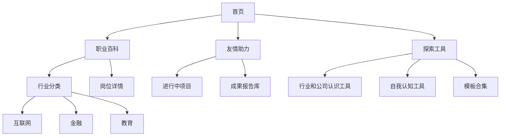

# 🌐 百家职业共享知识空间

> **让职业探索像查字典一样简单** • 已收录 `{{#职业词条}}` 个职业 • `{{#同好接力报告}}` 份一手报告

---

## 🎯 愿景与目标

> 我们的愿景是打破职业信息壁垒，构建一个**鲜活、真实、动态的职业百科全书。**

 **我们的目标：**
- **动态百科**：建立持续更新的职业活字典  
- **降低门槛**：为学生探索者提供零焦虑的认知路径  
- **接力共创**：让人人都能成为知识的贡献者和受益者

---

## ⛳️ 知识空间架构



---

## ⭐️ 核心资源导航

### 职业百科体系

```dataview
TABLE 行业 AS "行业分类", length(rows) AS "岗位数量"
FROM "职业百科"
WHERE file.path != this.file.path
GROUP BY 行业
SORT length(rows) DESC
```
**快速入口**：

- [[互联网行业目录]] • [[制造行业目录]] • [[教育行业目录]]
- [[自我认知工具]]• [[访谈报告模板]]

### 同好接力专区
```dataview
TABLE 负责人, 状态, 截止日期
FROM "同好接力/进行中项目"
SORT 截止日期 ASC
LIMIT 5
```
**行动入口**：

- [[查看全部进行中项目]] • [[发起新接力项目]]
    
- [[访谈报告模板]] • [[体验日记模板]]
    

---

## 💡 空间使用指南

### 新手指南

1. 浏览职业：从[[行业分类导航]]开始探索
    
2. 参与行动：[[如何加入同好接力]]
    
3. 贡献知识：[[编辑职业词条指南]]
    

### 管理员支持

> 📌 **重要规范**：[[内容贡献协议]] >
> 🔍 遇到问题？在Issues提问或联系我
 ![[8a97c735d4d236546e7611b924e29548.jpg]]